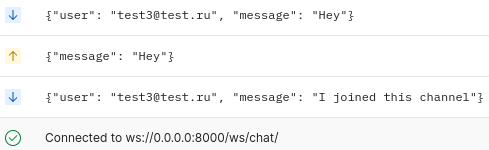

# Справочник мероприятий | REST API 

Тестовый проект, первый опыт работы с REST API

<details> 
  <summary>Текстовое задание</summary>
  
**Основные задачи приложения:**

1. Создать проект и приложение на Django Rest Framework >= 3.12 (Django > =3.2).
2. Реализовать возможность хранения номера телефона пользователя.
3. Использовать email и пароль при создании и авторизации пользователя.
4. Использовать JWT Token для аутентификации пользователя.
5. Создать модель Организации со следующими полями: title, description, address, postcode.
6. Создать модель Мероприятия со следующими полями: title, description, organizations, image, date.
7. Создать чат между пользователями использую технологию Web Socket.
8. Использовать для запуска проекта Docker.

  
**Дополнительное описание:**

- При создании пользователя не нужно использовать подтверждение по почте.
- Пользователи состоят в организациях. 
- Одно мероприятие могут организовывать несколько организаций. 
- Настроить панель администратора (добавить фильтрацию и поиск), при просмотре мероприятия выводить превью изображения. 
- Вывод информации и создание записей по api доступно только зарегистрированным пользователям. 
- При создании мероприятия необходимо использовать sleep 60 секунд и данный запрос не должен быть блокирующим. 

**Конечные точки:**

1. Создание организации
2. Создание мероприятия
3. Вывод мероприятия с информацией о всех действующих пользователей, которые участвуют в организации мероприятия с разбивкой по организациям (вывести информацию о организации с объединением почтового индекса и адресом).
4. Вывод мероприятий с возможностью фильтрации и сортировки по дате, поиском по названию и лимитной пагинацией.
</details>

Для реализации тестового приложения были выбран след. стек:
- Django;
- DRF;
- WebSocket;
- Celery;
- Docker;
- Redis;
- Sqlite3.

Для запуска проекта, необходимо выполнить в каталоге приложения: ``` docker compose up -d ```

Сервер слушает по адресу ``` 0.0.0.0:8000 ```
## Справка по API

<details>
    <summary>User</summary>

#### Регистрация
``` http POST /api/user/sign-up/ ```

Регистрирует пользователя в системе

| Parameter | Type     | Description                        |
|:----------| :------- |:-----------------------------------|
| `email`   | `string` | **Обязательно**. Электронная почта |
| `password` | `string` | **Обязательно**. Пароль            |
| `telephone` | `string` | **Опционально**. Номер телефона    |

#### Вход

``` http POST /api/user/sign-in/ ```

Вход пользователя в систему, возвращает JWT Access Token и Refresh Token

| Parameter | Type     | Description                        |
|:----------| :------- |:-----------------------------------|
| `email`   | `string` | **Обязательно**. Электронная почта |
| `password` | `string` | **Обязательно**. Пароль            |

#### Обновление токена

``` http POST /api/user/refresh/ ```

Возвращает новую сгенерированную пару JWT Access Token и Refresh Token

| Parameter  | Type     | Description                                           |
|:-----------| :------- |:------------------------------------------------------|
| `refresh`  | `string` | **Обязательно**. Токен обновления, выданный при входе |
</details>
<details>
<summary>Organizations</summary>

#### Создание новой организации

``` http POST /api/organizations/create/ ```

Создает организацию в системе, с указанными пользователями

| Parameter     | Type         | Description                                                   |
|:--------------|:-------------|:--------------------------------------------------------------|
| `title`       | `string`     | **Обязательно**. Название организации                         |
| `description` | `string`     | **Не обязательно**. Описание                                  |
| `postcode`    | `string`     | **Не обязательно**. Почтовый индекс                              |
| `address`     | `string`     | **Не обязательно**. Физический адрес                             |
| `users`       | `list<dict>` | **Не обязательно**. Список пользователей состоящих в организации |


#### Вывод списка организаций

``` http GET /api/organizations/ ```

Выводит зарегистрированные организации списком

#### Вывод информации о организации

``` http GET /api/organizations/$(id) ```

Выводит информацию о определенной организации

| Parameter     | Type         | Description                                                      |
|:--------------|:-------------|:-----------------------------------------------------------------|
| `id`          | `int`        | **Обязательно**. Идентификатор организации                       |

</details>
<details>
<summary>Events</summary>

#### Создание нового мероприятия

``` http POST /api/events/create/ ```

Создает мероприятие в системе, с указанными организациями
Для выполнения ТЗ, при создании запускается таск Celery, 
который сохраняет переданный объект "мероприятие" через 60с.

(коротко: Сохранение события происходит через 60с.)

| Parameter       | Type         | Description                                                     |
|:----------------|:-------------|:----------------------------------------------------------------|
| `title`         | `string`     | **Обязательно**. Наименование меропрития                        |
| `description`   | `string`     | **Не обязательно**. Описание                                    |
| `image`         | `file`       | **Не обязательно**. Обложка мероприятия                         |
| `date`          | `date`       | **Не обязательно**. Время проведения                            |
| `organizations` | `list<dict>` | **Не обязательно**. Список организаций связанных с мероприятием |


#### Вывод списка мероприятий

``` 
http GET /api/events/?search=$(query_search)
                     &ordering=$(ordering_fields)
                     &limit=$(query_limit)
                     &$(filter_method)=$(filter_data)
```

Выводит зарегистрированные мероприятия списком


| Parameter         | Type     | Description                                                                          |
|:------------------|:---------|:-------------------------------------------------------------------------------------|
| `query_search`    | `string` | **Не обязательно**. Запрос для поиска по полю events.title                           |
| `ordering_fields` | `string` | **Не обязательно**. Упорядочивание вывода по полю events.date                        |
| `query_limit`     | `int`    | **Не обязательно**. Ограничение вывода определенным числом                           |
| `filter_method`   | `string` | **Не обязательно**. Метод фильтрации объектов для вывод (date, date__gte, date__lte) |
| `filter_data`     | `string` | **Не обязательно**. Значение для фильтрации выбранным методом                        |

#### Вывод информации о мероприятии

``` http GET /api/events/$(id) ```

Выводит информацию о определенном мероприятии

| Parameter     | Type         | Description                                |
|:--------------|:-------------|:-------------------------------------------|
| `id`          | `int`        | **Обязательно**. Идентификатор мероприятия |

</details>

## Чат на вебсокете

Заморачиваться не стал, в БД записи истории чата - нет.
Режим общения происходит полностью в реальном времени.

Расположение чата:
``` ws://0.0.0.0:8000/ws/chat/ ```

Подключение по JWT token, передающегося в заголовке ``` authorization ```<br>
Передача сообщений с помощью JSON.

